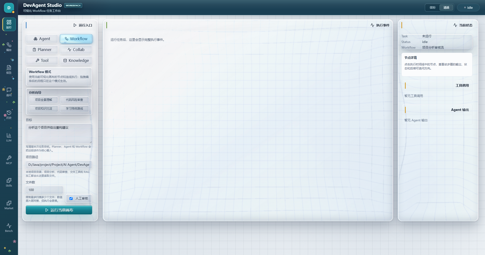
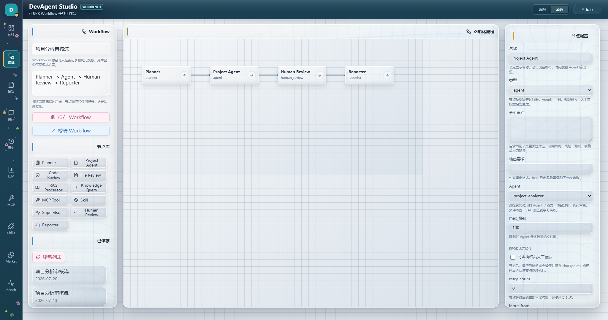
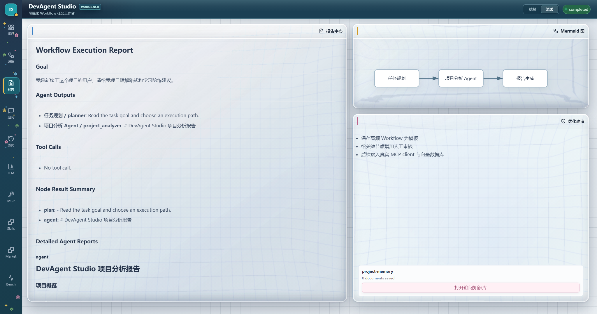
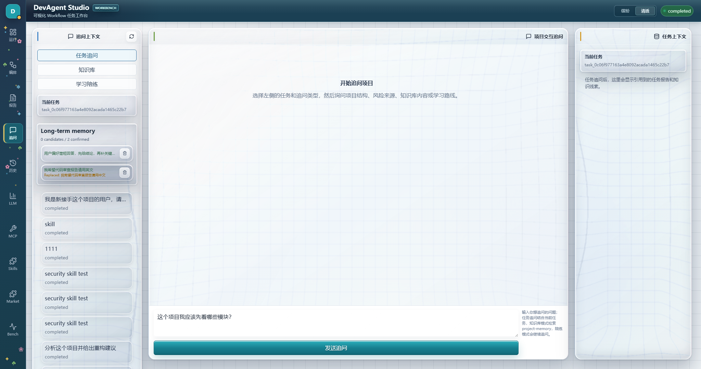
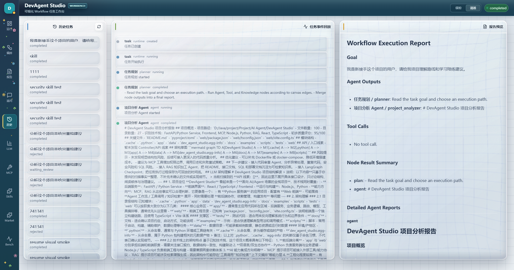
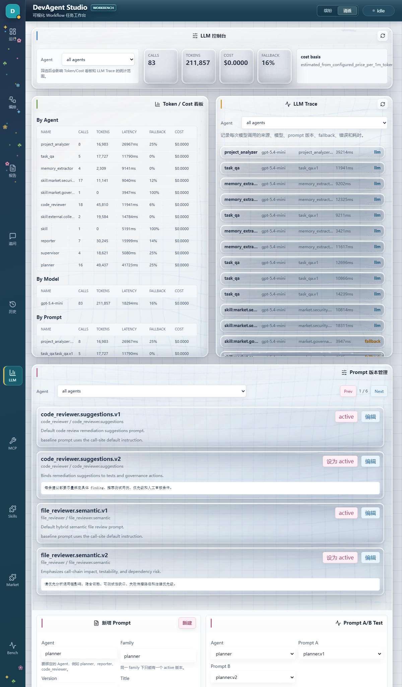
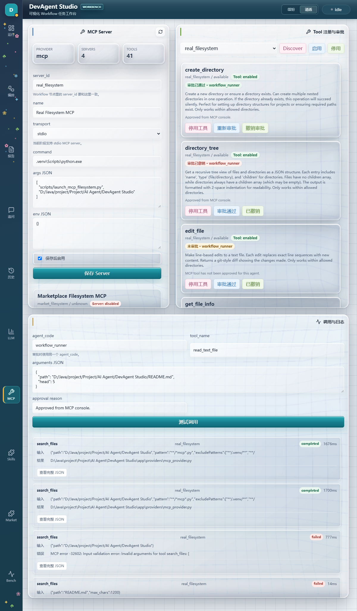
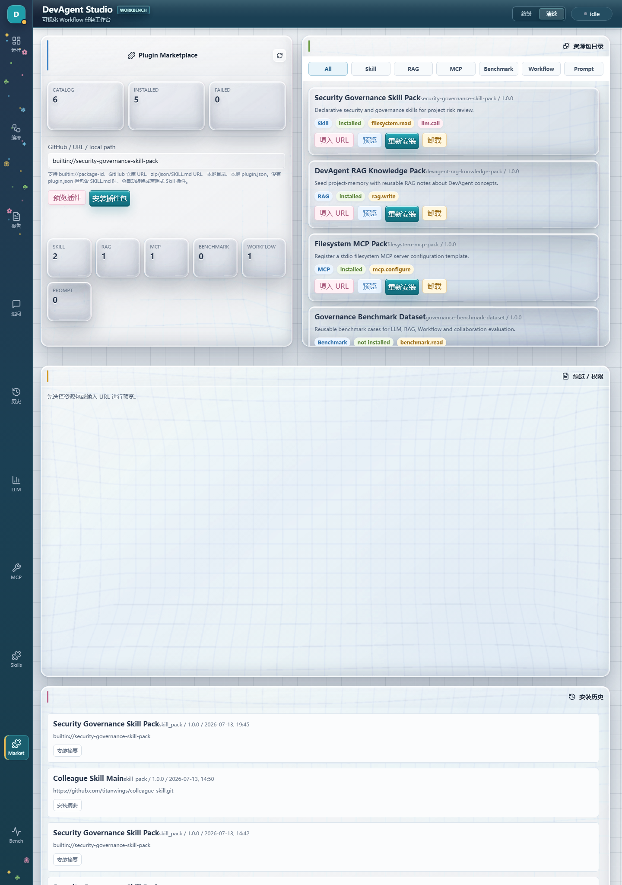
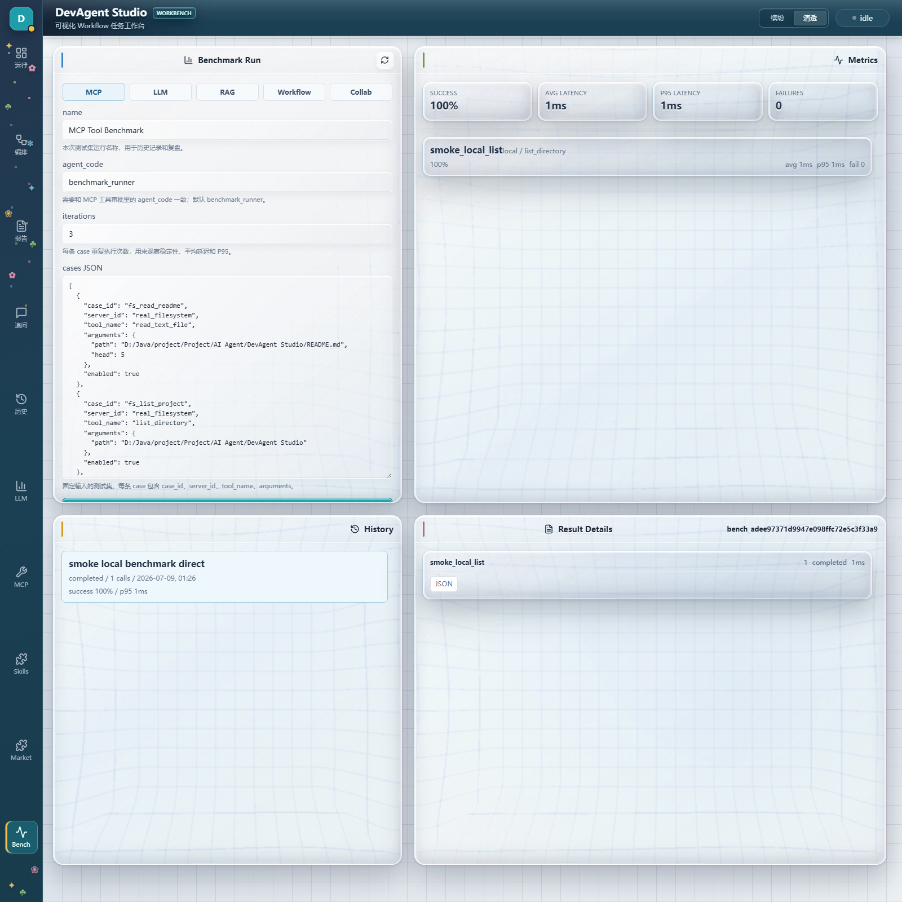

# DevAgent Studio

[English](#english) | [中文](#中文)

<a id="english"></a>

DevAgent Studio is an open-source multi-agent workbench for **software project understanding and engineering governance**. It is built with FastAPI, LangGraph, and React to help teams inspect project structure, review code risks, preserve project knowledge, govern AI and tool calls, and run traceable workflows.

It is deliberately not a code-writing IDE. Its focus is making software delivery work easier to understand, audit, evaluate, and improve.


## Why DevAgent Studio

- **Multi-agent workflows, not isolated prompts**: Planner, Project Analyzer, Code Reviewer, RAG Processor, Supervisor, and Reporter are composed through LangGraph.
- **Governed runtime**: Harness Runtime provides task context, event timelines, artifacts, review state, persistence, deterministic policy checks, and resume support.
- **Visual workflows that execute**: a drag-and-drop canvas is compiled into executable LangGraph workflows instead of serving as a static diagram.
- **Observable LLM operations**: prompt versions, model configuration, traces, token and cost data, fallback records, and A/B comparison are available from the UI.
- **Extensible Skills with guardrails**: Skills are versioned, permission-scoped, testable, dependency-aware, and usable from both the console and a workflow.
- **Plugin Marketplace**: install resource packs from built-in catalogs, local paths, URLs, GitHub-style sources, or an external `SKILL.md` file.
- **Safe third-party code execution**: Code Skills can run in a constrained Docker sandbox with no network, read-only mounts, resource limits, and audit logs.
- **Governed RAG that can be evaluated**: project knowledge now supports incremental indexing, document versions, ACL filtering, hybrid retrieval, optional LLM rerank, and editable chunk-level Gold Sets.
- **Switchable Colorful and Clear UI**: the React workbench can switch between a colorful theme with yellow/green/blue/pink environmental light pillars and a clear SVG-refraction liquid-glass theme with pointer ripples, hover lift, and connected mode transitions. The selected theme is persisted locally.

## Product Preview / 页面预览

The screenshots below show the Clear theme with per-surface SVG displacement maps, refracted grid detail, reflective rims, layered shadows, and liquid button interactions. Use the header switch to move between the Colorful and Clear themes at any time.

| Run workbench / 运行 | Visual workflow / 编排 |
| --- | --- |
|  |  |

| Reports / 报告 | Interactive chat / 追问 |
| --- | --- |
|  |  |

| Task history / 历史 | LLM governance / LLM |
| --- | --- |
|  |  |

| MCP console / MCP | Skills console / Skills |
| --- | --- |
|  |  |

| Plugin Marketplace / Market | Benchmark dashboard / Bench |
| --- | --- |
|  |  |

## Architecture

```text
User / React workbench
        |
        v
FastAPI APIs ---- Marketplace ---- Skills Console ---- MCP Console
        |
        v
Harness Runtime
  context | policy | events | artifacts | human review | persistence
        |
        +-----------------------+
        |                       |
        v                       v
LangGraph workflows          Skill Runtime
planner / reviewer /         prompt skills / code skills /
RAG / supervisor / reporter  dependency and permission checks
        |                       |
        +-----------+-----------+
                    v
      LLM / MCP / RAG / SQLite / pgvector / Docker sandbox
```

### Typical execution flow

```text
Task request
  -> FastAPI creates a task
  -> Harness Runtime creates context and emits events
  -> LangGraph invokes agents, Skills, LLMs, RAG, or MCP tools
  -> policy and human-review checks gate sensitive operations
  -> traces, artifacts, logs, and state are persisted
  -> Reporter produces a governance report
```

## Core Capabilities

| Area | What it provides |
| --- | --- |
| Project analysis | Structure scanning, technology identification, module summary, risks, and governance suggestions. |
| Code review | Hybrid rule, call-chain, and LLM semantic review with findings and test recommendations. |
| RAG knowledge | Governed project knowledge base with incremental indexing, document versions, document ACL, hybrid BM25/vector retrieval, optional LLM rerank, SQLite default storage, and pgvector extension. |
| Long-term memory | LLM/rule candidate extraction, explicit confirmation, conflict replacement, quality scoring, retention review, and scoped access boundaries. |
| Learning coach | Project-oriented learning plans and interactive follow-up questions. |
| Collaboration | Planner, analyzer, reviewer, RAG, supervisor, and reporter run as a traceable collaboration graph. |
| Workflow | Drag, connect, configure, validate, save, and execute workflow JSON compiled to LangGraph. |
| Human review | Node-level approval/rejection, checkpoint/resume, retry, and recovery visualization. |
| LLM governance | Per-agent model configuration, call trace, prompt versions, token/cost data, fallback display, and A/B tests. |
| MCP management | Server registration, stdio tool discovery, enable/disable, approval, test invocation, and call logs. |
| Benchmark | LLM, RAG, Workflow, MCP, and multi-agent evaluation with success rate, P95 latency, chunk Gold Set Recall@K, Precision@K, MRR, completeness, token, and cost metrics. |

## RAG Governance and Evaluation

The RAG layer is designed as a governed project knowledge base rather than a simple chunk search demo.

| Capability | What changed |
| --- | --- |
| Incremental indexing | Documents are hashed by content. Unchanged files are skipped; changed files create a new version. |
| Versioned documents | Current retrieval only uses the active version, while old versions remain auditable with `valid_to`. |
| Hybrid retrieval | SQLite uses BM25 plus token semantic overlap. pgvector uses vector candidates plus BM25 and RRF fusion. |
| Optional rerank | `DEV_AGENT_RAG_RERANKER=llm` enables an LLM reranker with JSON-only ordering and fallback to RRF. |
| Document ACL | Documents can be restricted by principal, and queries/listing filter by actor identity. |
| Chunk Gold Set | Benchmark cases can store expected chunk IDs and calculate Chunk Hit, Recall@K, Precision@K, and MRR. |
| Gold Set UI | The Benchmark page can create, edit, delete, and load RAG Gold Set cases into benchmark runs. |

This turns RAG from "can retrieve something" into "can be versioned, permissioned, measured, and improved."

## Governed Long-term Memory

Conversation history is not written directly into the knowledge base. Durable memory follows a governed pipeline:

```text
User message
  -> LLM Memory Extractor (or deterministic rule fallback)
  -> candidate memory + sensitive-content filter
  -> quality score + conflict detection + retention policy
  -> explicit user approval
  -> scoped RAG ingestion
  -> retrieval, review, expiry, or deletion audit trail
```

- **LLM-first extraction with fallback**: `memory_extractor` emits structured candidates for durable preferences, project facts, and team policies. Without an LLM, explicit-preference rules keep the feature usable offline.
- **Confirmation before ingestion**: candidates never enter RAG until the user confirms them. Rejection and deletion prevent unwanted persistence.
- **Conflict-aware updates**: confirming a conflicting value marks the prior record as `superseded`, while preserving history.
- **Quality and retention**: each record has a quality score and reasons. Stable project/team rules and language/security preferences persist; general preferences use `review_90d` and become `expired` instead of being silently deleted.
- **Memory decay, not blind accumulation**: stale or low-durability memories leave the retrieval path after their review window. They remain auditable as `expired` until explicitly refreshed or deleted, preventing old preferences and obsolete decisions from continuously biasing agents.
- **Scoped access boundaries**: user, project, and team memories are separated. The local API accepts `X-DevAgent-Actor` and `X-DevAgent-Role`; project writes require `editor/admin`, while team confirmation and deletion require `admin`.

```env
DEV_AGENT_MEMORY_EXTRACTOR=llm
DEV_AGENT_LLM_MODEL_MEMORY_EXTRACTOR=gpt-4o-mini
```

Set `DEV_AGENT_MEMORY_EXTRACTOR=rule` to disable LLM extraction. Its traces appear in the LLM Console under `memory_extractor`.

## Governed Skill Plugin System

A Skill is a reusable capability such as code review, RAG processing, learning coaching, security scanning, or workflow execution. A Skill can be tested in the Skills console or added to a visual workflow.

### Skill governance

| Capability | Purpose |
| --- | --- |
| Contract validation | Validates `input_schema`, `output_schema`, `permissions`, and `execution_type` during package preview and install. |
| Permission levels | Classifies access as `safe`, `project-read`, `llm`, `workflow-write`, `network`, or `filesystem`, and calculates risk. |
| Strict approvals | Approval is scoped by `skill_code + agent_code`; testing and workflow execution are independently approved. |
| Version management | Keeps Skill snapshots for upgrade comparison and rollback. |
| Dependencies | Declares MCP tools, RAG collections, prompt versions, and model requirements before execution. |
| Built-in tests | Allows packages to provide test cases and lets users run them after installation. |
| Trust metadata | Records source URL, author, manifest signature verification, install count, and local validation state. |
| Workflow mapping | Maps outputs from earlier workflow nodes into a Skill node input. |

### Prompt Skill and Code Skill

An external `SKILL.md` is imported as a **Prompt Skill** when there is no `plugin.json`. The system reads its instruction text and uses it as an LLM prompt. It never executes third-party code.

A **Code Skill** contains an executable entry point, for example:

```text
plugin/
  plugin.json
  skills/
    security_scan.py
```

```json
{
  "code": "security.scan",
  "execution_type": "python",
  "entrypoint": "skills/security_scan.py:run",
  "permissions": ["project-read"]
}
```

### Docker sandbox for Code Skills

Code Skills can use a Docker sandbox. The runtime starts a temporary container and removes it when execution ends. The sandbox applies:

- `--network none`: no outbound network access.
- `--read-only`: immutable container root filesystem.
- read-only mount for the Skill package.
- memory, CPU, PID, and execution-time limits.
- dropped Linux capabilities and `no-new-privileges`.
- invocation result and failure logging.

This makes third-party extensions practical without treating them as trusted local code. Docker isolation is a defense layer, not a substitute for reviewing plugin source and permissions.

## Plugin Marketplace

The Marketplace installs and tracks resource packages. Supported package types include `skill_pack`, `rag_pack`, `mcp_pack`, `prompt_pack`, `workflow_pack`, and `benchmark_pack`.

Supported sources:

- Built-in catalog packages.
- Local folders or a local `plugin.json`.
- URL and GitHub-style package sources.
- External `SKILL.md` files, automatically converted to a safe Prompt Skill.

After installation, the UI shows installed resources, source and trust details, available Skills, approval actions, test calls, workflow insertion, and uninstall status.

### Strict approval model

```text
approval key = skill_code + agent_code
```

The two common execution identities are:

| Agent code | Meaning |
| --- | --- |
| `skill_console` | Manual test call from the Skills page. |
| `workflow_runner` | Automatic call from a visual workflow. |

Approving `skill_console` does not approve `workflow_runner`. A Skill must be explicitly approved for the context in which it will run.

## Quick Start

### Requirements

- Python 3.11+ (Python 3.13 is supported by the current project setup)
- Node.js 18+
- Docker Desktop, optional for pgvector and Docker Code Skill sandboxing

### Install

```powershell
git clone https://github.com/biheto/DevAgent-Studio.git
cd DevAgent-Studio

python -m venv .venv
.\.venv\Scripts\activate
pip install -e ".[llm,vector,dev]"

cd web
npm install
npm run build
cd ..

copy .env.example .env
```

### Start the application

```powershell
.\.venv\Scripts\python.exe -m uvicorn app.main:app --host 127.0.0.1 --port 8100
```

Open `http://127.0.0.1:8100/` for the workbench and `http://127.0.0.1:8100/docs` for the API documentation.

### Optional services

Run pgvector:

```powershell
docker compose -f docker-compose.pgvector.yml up -d
```

Configure Docker Code Skill sandboxing in `.env`:

```env
DEV_AGENT_SKILL_SANDBOX=docker
DEV_AGENT_SKILL_SANDBOX_IMAGE=python:3.13-slim
DEV_AGENT_SKILL_SANDBOX_MEMORY=256m
DEV_AGENT_SKILL_SANDBOX_CPUS=0.5
DEV_AGENT_SKILL_SANDBOX_PIDS_LIMIT=64
DEV_AGENT_SKILL_SANDBOX_FALLBACK=false
```

`subprocess` is the default sandbox mode for local development. `docker` requires Docker Desktop to be running. The sandbox status can be checked at `GET /api/v1/skills/sandbox/status`.

### LLM configuration

The application works with deterministic fallback responses when no key is configured. Set an API key for real LLM calls:

```env
OPENAI_API_KEY=your_api_key
OPENAI_BASE_URL=
DEV_AGENT_LLM_MODEL=gpt-4o-mini

# Optional per-agent overrides
DEV_AGENT_LLM_MODEL_PLANNER=gpt-4o-mini
DEV_AGENT_LLM_MODEL_REPORTER=gpt-4o-mini
DEV_AGENT_LLM_MODEL_CODE_REVIEWER=gpt-4o-mini
```

## Development Checks

```powershell
# Backend compilation
.\.venv\Scripts\python.exe -m compileall -q app

# Frontend production build
cd web
npm run build
cd ..

# Governed long-term memory tests
.\.venv\Scripts\python.exe -m unittest tests.test_memory_store -v

# RAG governance tests
.\.venv\Scripts\python.exe -m unittest tests.test_rag_governance -v

# Verify the Skill sandbox configuration
.\.venv\Scripts\python.exe -c "from app.skills.sandbox import python_skill_sandbox_status; print(python_skill_sandbox_status())"
```

## Project Structure

```text
DevAgent Studio/
  app/
    agents/              # Project, review, RAG, learning, and report logic
    api/                 # FastAPI route modules
    graphs/              # LangGraph graphs and visual workflow compiler
    harness/             # Context, events, policy, artifacts, review/resume runtime
    marketplace/         # Package preview, installer, trust, and SKILL.md compatibility
    persistence/         # Task, governance, RAG, and trace persistence
    providers/           # LLM, MCP, and RAG provider interfaces
    skills/              # Registry, contracts, versions, dependencies, sandbox runtime
    benchmark_runner.py  # LLM/RAG/Workflow/MCP/collaboration benchmarks
  web/                   # React workbench
  scripts/               # MCP launchers and test servers
  docs/                  # Architecture and implementation notes
  examples/              # API request examples
  docker-compose.pgvector.yml
```

## Documentation

- [Implementation timeline](docs/IMPLEMENTATION_TIMELINE.md)
- [Workflow production notes](docs/PHASE_8_WORKFLOW_PRODUCTION.md)

## Roadmap

- Add a richer UI for Docker sandbox health and test invocation.
- Add signed external plugin publishing examples and contributor tooling.
- Expand API, workflow compiler, runtime-state, MCP contract, LLM fallback, and benchmark integration test coverage.
- Add conditional branch, parallel node, and richer input/output mapping UX for workflows.

## License and Attribution

This project is licensed under the [MIT License](LICENSE).

Copyright (c) 2026 biheto. When redistributing the project, preserve the original copyright notice and license text.

```text
DevAgent Studio by biheto
https://github.com/biheto/DevAgent-Studio
```

---
